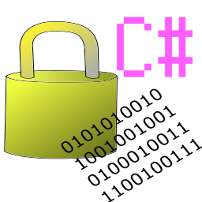

# Memory Lock

[](https://dev.azure.com/capra314cabra/MemoryLock/_build/latest?definitionId=5&branchName=master)
[](https://www.nuget.org/packages/MemoryLock/)
[](https://github.com/capra314cabra/MemoryLock/blob/master/LICENSE)
[](https://dev.azure.com/capra314cabra/MemoryLock/_build/latest?definitionId=5&branchName=master)
[](https://github.com/capra314cabra/MemoryLock)

<p align="center">
  
</p>

With this library, you can pin the managed object or allocate the memory easily. And you never forget releasing them.

## What is this ?

This is a wrapper library for :

- `System.Runtime.InteropServices.Marshal.AllocCoTaskMem`
- `System.Runtime.InteropServices.Marshal.FreeCoTaskMem`
- `System.Runtime.InteropServices.Marshal.AllocHGlobal`
- `System.Runtime.InteropServices.Marshal.FreeHGlobal`
- `System.Runtime.InteropServices.GCHandle.Alloc`
- `System.Runtime.InteropServices.GCHandle.Free`

They are used for allocating memories which is never collected or moved by GC (Garbage Collector).  
People use these functions when they want to call native codes by P/Invoke because passing some parameters to C++ requires to prepare memories not moved.

## Why wrap them ?

__After allocating memories, we have to release them.__  
It is so bothered. Isn't it ?  
That is why I implemented this library.  
Using Memory Lock, you don't have to pay attention to memories whether they are released or not.

Watch the following code :
``` C#
// using System.Runtime.InteropServices;

// Allocate memories by "size"
var pointer = Marshal.AllocCoTaskMem(size);

//
// Do something
//

// Release memories
Marshal.FreeCoTaskMem(pointer);

// "pointer" refers to nothing but the parameter alives.
// If you use "pointer" here, it will cause "undefined behaviour".
```

This is an ordinary code using `Marshal.AllocCoTaskMem`.  
I think it has some problems : 
- When you forget to write Free(), It is too difficult to realize the mistake.
- You can access the pointer which is released easily.

With Memory Lock, you can write the following code :

``` C#
// using CapraLib.MemoryLock;

// Allocate memories
using(var allocated = new MemoryAllocater(out var pointer, size))
{
    // Do something
}

// You can't access to the pointer here !
// And they are already released !
```

This library solves the problems clearly !  
In C# 8, you can use this with ["using declarations"](https://docs.microsoft.com/en-us/dotnet/csharp/whats-new/csharp-8#using-declarations).

## Examples

### Allocate 100 bytes

``` C#
using(var allocated = new MemoryAllocater(out var pointer, 100))
{
    // Do something with "pointer" !
}
```

The following table will help you.

| Allocate memory by ... | Size | Unmanaged object |
|---|:---:|:---:|
| CoTaskMemAllocater | :heavy_check_mark: |
| HGlobalAllocater | :heavy_check_mark: |
| CoTaskMemAllocater&lt;T&gt; || :heavy_check_mark: |
| HGlobalAllocater&lt;T&gt; || :heavy_check_mark: |
| GCAllocater&lt;T&gt; || :heavy_check_mark: |

Unmanaged object includes : 
- `sbyte`, `byte`, `short`, `ushort`, `int`, `uint`, `long`, `ulong`, `char`, `float`, `double`, `decimal`, `bool`
- User defined structs which has attribute, `[StructLayout(LayoutKind.Sequential)]`

### Using struct

If you have a struct :

``` C#
// StructLayout should be LayoutKind.Sequential
// when it is used in Memory Lock
[StructLayout(LayoutKind.Sequential)]
public struct Vector
{
    public float x;
    public float y;
    public float z;
}
```

And a native function : 

``` C#
// Assign values to vec
[DllImport("Some.dll")]
static extern void ChangeAll(IntPtr vec, float x, float y, float z);
```

On that time, you can write the following code : 

``` C#
// using CaprLib.MemoryLock;

var vec = new Vector();
vec.x = 10f;

using(var allocated = new MemoryAllocater<Vector>(out var pointer, vec))
{
    // Assign another values to the pointer
    ChangeAll(pointer, 15f, 19f, 23f);

    // Copy from unmanaged memory to managed.
    allocated.CopyTo(out vec);
}

Console.WriteLine($"vec.x = {vec.x}"); // vec.x = 15
```

Before releasing the memory, you can call `void CopyTo(out T obj)` to save changes to managed items.  
This function is implemented in

- `MemoryAllocater<T>`
- `CoTaskMemAllocater<T>`
- `HGlobalAllocater<T>`
- `GCAllocater<T>`

## Author

[capra314cabra](https://github.com/capra314cabra)
